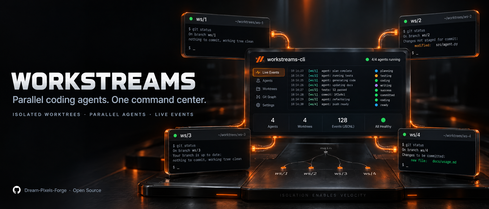

# workstreams



Visually dispatch coding-agent work to subagents in real terminal windows and monitor it in one dashboard — for any coding agent (Claude Code, Codex, OpenCode, Qwen Code, Hermes, Cline, and more).

`workstreams` runs your coding agents **in parallel across real terminal windows** (tmux, zellij), isolates each one in its own git worktree + branch, and gives you a single live dashboard to watch them all. Instead of running subagents invisibly inside one agent's process, you **see each agent working in its own visible window** and get event-streamed progress back to one shared log.

Key capabilities:

- **Parallel coding agents in visible terminals** — one agent per tmux window / zellij tab, all in a detached session you can attach to at any time
- **Git worktree isolation** — each workstream gets its own branch (`ws/N`) and working directory, so agents never step on each other's files
- **Live monitoring dashboard** — `workstreams monitor` renders a real-time TUI: git status, PIDs, log alerts, and the last subagent events, refreshing every 2 seconds
- **Cross-process subagent event logging** — any agent or script (in a pane, a CI job, a cron) appends JSONL events to one shared file; you read them from any terminal
- **Cross-terminal notifications** — desktop notifications (Linux `notify-send`, macOS `osascript`) plus a shared `notifications.jsonl` that other terminals can poll
- **Agent-agnostic** — no vendor lock-in. `dispatch` and `work` send arbitrary shell commands to panes, so it works with whatever agent binary you can run from a shell

## Why this exists

Coding agents increasingly support "subagents" that run in the background of the main agent's process. That means: no visibility (you can't watch them), no isolation (they share one working tree and one set of installed dependencies), no way to run several in parallel on independent branches, and no shared event stream you can watch from your main terminal.

`workstreams` solves this by moving each subagent into a **real, visible terminal window** running in its own git worktree, and wiring all of them back to **one shared event log + one dashboard**. Your main agent (or you, manually) dispatches tasks, watches progress in `monitor`, and finishes with PR/merge commands.

## Contents

- [Installation](#installation)
- [Core Concepts](#core-concepts)
- [Quick Start (5 commands)](#quick-start-5-commands)
- [The Full Workflow](#the-full-workflow)
- [Command Reference](#command-reference)
- [Configuration (.workstreams.yaml)](#configuration-workstreamsyaml)
- [How the Multiplexers Work](#how-the-multiplexers-work)
- [Subagent Event System (Python API + CLI)](#subagent-event-system)
- [Environment Variables](#environment-variables)
- [Exit Codes](#exit-codes)
- [Data Locations](#data-locations)
- [Integrating With Coding Agents (Skill)](#integrating-with-coding-agents-skill)
- [CI/CD Integration](#cicd-integration)
- [Troubleshooting](#troubleshooting)
- [Best Practices](#best-practices)
- [Architecture](#architecture)
- [Contributing & License](#contributing--license)

---

## Installation

Requires **Python 3.9+** and **git**. A terminal multiplexer (`tmux` recommended, or `zellij`, `nami`, `lmux`, `wmux`, `herdr`) is required for `start`/`dispatch`/`work` to actually place agents into visible windows. `pr`/`merge` commands additionally require the `gh` CLI (GitHub) authenticated.

```bash
# from PyPI (core; JSON config fallback built-in)
pip install workstreams-cli

# with YAML config support (recommended — .workstreams.yaml becomes first-class)
pip install "workstreams-cli[yaml]"

# develop from source (this repo)
git clone https://github.com/Dream-Pixels-Forge/workstreams-cli.git
cd workstreams-cli
pip install -e ".[yaml,dev]"   # dev extras add pytest
```

> **Ubuntu / Debian (PEP 668 "externally-managed environment")** — system pip refuses bare `pip install`. Use `pipx` (recommended; installs a standalone `workstreams` command on your PATH) or a virtualenv:
>
> ```bash
> # option 1: pipx — cleanest, no venv juggling
> pipx install workstreams-cli
>
> # option 2: virtualenv
> python3 -m venv ~/.workstreams-venv
> ~/.workstreams-venv/bin/pip install "workstreams-cli[yaml]"
> export PATH="$HOME/.workstreams-venv/bin:$PATH"
> ```

Verify:

```bash
workstreams --version   # -> workstreams 0.5.1
```

> **Note:** every command also accepts `--json` to emit machine-readable output (where supported), which coding agents can parse. All read-side commands work without a multiplexer installed; only `start`/`dispatch`/`work`/`attach` need one.

---

## Core Concepts

Understanding these five terms makes everything else click.

### 1. Workstream
An isolated development lane. Each workstream has its own:

- **git branch** (default `ws/<id>`, e.g. `ws/1`, `ws/2`)
- **working directory** — a git worktree under `worktrees/<id>/` next to your repo (default mode)
- **terminal window/pane** — one tmux window or zellij tab named after the workstream
- **task assignment** — one or more issues, or a free-form prompt
- **its own log file** — `worktrees/<id>/logs/worker.log`

### 2. Multiplexer
The terminal tool that hosts the visible windows. `workstreams` currently supports:

| Multiplexer | Layouts | Notes |
|-------------|---------|-------|
| `tmux` (default) | `even-horizontal`, `even-vertical`, `main-horizontal`, `tiled` | One **window per workstream** (cleanest for agents), or all in one tiled window. Detached sessions survive your logout. |
| `zellij` | tabs | One **tab per workstream**. Simpler scripting surface; `dispatch` targets the current tab only. |

The tmux/zellij session is auto-named `workstreams-<project>`.

### 3. Subagent
The coding agent doing the work inside a workstream. This is deliberately **free-form**: `claude-code`, `codex`, `opencode`, `qwen-code`, `mimocode`, `hermes`, `kilo-code`, `cline`, or any label you want. There is no vendor lock-in — a subagent is just an identifier used in the event log. The agent that actually runs is whatever command you send into the pane (see `dispatch`/`work`).

### 4. Event
A JSONL record written to a shared log whenever a subagent reports progress. Event types: `started`, `progress`, `completed`, `failed`, `error`, `done`. Events are the backbone of the dashboard and the cross-terminal notification flow.

### 5. Dashboard
`workstreams monitor` — a full-screen ANSI TUI (no external TUI deps) that re-renders every 2s (configurable) showing, per workstream: id, name, branch, git status, PID, last commit/activity, recent log alerts — plus a "Subagent Activity (last 10)" feed. Exit with `q` or Ctrl+C.

### Worktree mode vs Branch mode (`init --mode`)

- `worktree` (default, **recommended**): creates a real git worktree — a separate checkout directory under `worktrees/`. Maximum isolation; each lane has its own files. Slightly more disk.
- `branch`: all lanes share one directory and you switch branches. Faster and shares `node_modules`/`.venv` naturally, but agents switching branches concurrently can collide.

---

## Quick Start (5 commands)

```bash
# 0) install (once)
pip install "workstreams-cli[yaml]"

# 1) create 3 parallel lanes for a project, each in its own worktree + branch
workstreams init --project myproj --workstreams 3

# 2) open visible tmux windows and drop an agent into each (one window per lane)
workstreams start --multiplexer tmux --cmd "claude"

# 3) hand a task to lane 1 (fires a "started" event, notifies, sends the prompt into that pane)
workstreams dispatch --workstream 1 --subagent claude-code --issue 42 --prompt "Fix auth"

# 4) (optional) block the main terminal until lane 1's agent reports done/failed
# workstreams dispatch ... --wait

# 5) watch everything in one live dashboard (Ctrl+C to leave)
workstreams monitor
```

Now you have three tmux windows, each running its own agent on its own branch, and a single dashboard watching all of them.

> **Tip:** to actually *see* the windows: `workstreams attach` (or `tmux attach -t workstreams-myproj`).

---

## The Full Workflow

A complete feature-from-scratch to merged loop:

```bash
# ── 1. Plan ──────────────────────────────────────────────────────────────
# Decide N lanes and what each owns. e.g. backend / frontend / database.

# ── 2. Initialize ───────────────────────────────────────────────────────
workstreams init --project myproj \
  --workstreams 3 \
  --multiplexer tmux \
  --layout even-horizontal \
  --base-branch main \
  --mode worktree

# Creates:
#   worktrees/ws1/  (branch ws/1)
#   worktrees/ws2/  (branch ws/2)
#   worktrees/ws3/  (branch ws/3)
#   .workstreams.yaml  (the config file, in your repo root)

# ── 3. Start visible terminals ──────────────────────────────────────────
workstreams start --multiplexer tmux
#   -> tmux session 'workstreams-myproj', one window per lane, persistent shell

# ── 4. Dispatch work ────────────────────────────────────────────────────
# Option A: send a ready-made agent command into the pane
workstreams dispatch --workstream 1 --subagent claude-code --issue 42 \
  --prompt "Implement JWT auth"

# Option B: run a specific agent binary with a task (agent-agnostic)
workstreams work --workstream 2 --agent "codex" --task "Build the login UI" \
  --subagent codex --issue 43

# Option C: a plain shell command in a lane (tests, builds, migrations)
workstreams run --workstream 3 --cmd "npm test"

# ── 5. Watch ────────────────────────────────────────────────────────────
workstreams monitor                    # live dashboard
workstreams events --since 30          # last 30 min of subagent events
workstreams logs --workstream 1 --follow   # tail one lane's log

# ── 6. Keep lanes fresh with main ──────────────────────────────────────
workstreams sync --workstream 1        # merge origin/main into ws/1
workstreams sync --workstream 1 --rebase   # ... or rebase instead

# ── 7. Ship ─────────────────────────────────────────────────────────────
workstreams pr --workstream 1 --title "feat: add JWT auth" \
  --body "Closes #42" --draft
#   -> pushes ws/1, runs: gh pr create --base main --head ws/1

# ── 8. Merge & clean up ─────────────────────────────────────────────────
workstreams merge --workstream 1 --method squash --delete-branch
workstreams workstream cleanup --workstream 1 --force
```

---

## Command Reference

Run `workstreams <command> --help` for per-command flags. `--project` and `--json` are accepted by almost every command.

| Command | What it does |
|---------|--------------|
| `init` | Create workstreams (worktrees + branches + `.workstreams.yaml`) |
| `start` | Open the multiplexer session and start the configured lanes (optionally running a command in each) |
| `attach` | Attach to the existing multiplexer session so you can *see* the windows |
| `status` | Print a one-shot status table (or `--json`) |
| `monitor` | Live TUI dashboard (default: refresh 2s; `q`/Ctrl+C exits) |
| `dispatch` | Send a task/prompt to a lane's pane; logs a `started` event; notifies |
| `work` | Run an arbitrary agent command in a lane (`<agent> <task>`); optional `--wait` |
| `run` | Run a plain shell command in a lane's directory (not sent to the pane) |
| `logs` | Tail a lane's `worker.log` (`--follow` to stream) |
| `tail` | Snapshot of the last N lines of one or all lanes' logs |
| `events` | Print recent subagent events (filter by lane/type/subagent; `--json`) |
| `event` | **Emit one event from the calling process** (the key agent-integration command) |
| `notify` | Send a desktop + file notification to other terminals |
| `assign` | Record issue numbers against a lane (bookkeeping in the lane log) |
| `sync` | `git fetch` + merge/rebase a lane with the base branch |
| `pr` | Push the lane's branch and open a GitHub PR via `gh` |
| `merge` | Merge the lane's PR via `gh` (squash/merge/rebase; optional `--delete-branch`) |
| `workstream add` | Add a new lane to the config (and create its worktree) |
| `workstream remove` | Remove a lane (optionally `--force` to delete its worktree) |
| `workstream cleanup` | Delete completed lanes' worktrees |

### Flag details (the ones that matter)

`init`
- `--workstreams N` — how many lanes to create (default 4)
- `--multiplexer tmux|zellij`
- `--layout even-horizontal|even-vertical|main-horizontal|tiled`
- `--base-branch main` — the branch all lanes fork from
- `--mode worktree|branch`
- `--agent auto|claude|codex|opencode|qwen|generic` — hint stored in config
- `--force` — overwrite an existing `.workstreams.yaml`
- `--no-worktrees` — write config only, skip `git worktree add` (useful to pre-plan then materialize later)

`start`
- `--workstream N` — start a single lane
- `--cmd "<command>"` — command to send into each pane (e.g. `claude`, `codex`)
- `--multiplexer` / `--layout` — override config for this run

`dispatch`
- `--workstream N` (required)
- `--subagent <label>` (required, free-form identifier)
- `--issue N` — GitHub issue number
- `--prompt "<text>"` — the task text sent into the pane
- `--agent <binary>` — if set, the pane receives `<binary> <prompt>`; if omitted, the prompt is sent verbatim
- `--wait` — block until that subagent emits `completed`/`failed`/`done` (4h safety timeout)
- `--multiplexer` — override

`work`
- `--workstream N`, `--agent <cmd>`, `--task <text>` (required)
- `--subagent <label>`, `--issue N` — event-log metadata
- `--wait` — block for a terminal event

`events` / `event`
- `events`: `--workstream N`, `--since <minutes>` (default 10), `--type started|progress|completed|failed|error|done`, `--subagent <label>`, `--limit N`, `--clear`, `--json`
- `event`: `event <started|progress|completed|failed|error|done> --project P --subagent L [--workstream N] [--issue N] [--message "..."] [--data '{"files":3}'] [--json]`

`sync` — `--workstream N` (omit to sync all), `--rebase` (else merge)

`pr` — `--workstream N --title "..." --body "..." [--base BRANCH] [--draft]`

`merge` — `--workstream N [--method merge|squash|rebase] [--delete-branch] [--auto]`

`workstream add` — `--name X --branch B [--path P] [--command CMD]`

---

## Configuration (.workstreams.yaml)

Created by `init` in your repo's root. Edit by hand to give lanes meaningful names, commands, and env. If PyYAML is installed (`workstreams-cli[yaml]`) this is read/written as YAML; otherwise workstreams falls back to a JSON file (`.workstreams.json`).

```yaml
project: myproject
multiplexer: tmux            # tmux | zellij | nami | lmux | wmux | herdr
layout: even-horizontal     # even-horizontal | even-vertical | main-horizontal | tiled
base_branch: main
mode: worktree              # worktree | branch
agent: auto                 # auto | claude | codex | opencode | qwen | generic

workstreams:
  - id: 1
    name: backend
    path: ./backend          # worktree dir (relative to repo root) or subdir
    branch: ws/backend
    command: "npm run dev"   # auto-run on start (or leave "" and use --cmd)
    env:
      PORT: "3001"
  - id: 2
    name: frontend
    path: ./frontend
    branch: ws/frontend
    command: "npm run dev"
    env:
      PORT: "3002"

shared_deps:                 # directories to symlink/share across lanes
  - node_modules
  - .venv
```

**Config resolution order** (highest wins): CLI flag → `.workstreams.yaml` → environment variable → default.

---

## How the Multiplexers Work

### tmux (default, most robust)
- Session name: `workstreams-<project>` (detached, survives logout).
- **Window-per-workstream** (all layouts except `tiled`): each lane becomes a tmux *window* named after the workstream (`backend`, `frontend`, …). Windows are addressable **by name** (`<session>:<window-name>`), which is how `dispatch`/`work` send the prompt to the *correct* lane.
- **Tiled layout**: all lanes are panes in one window, targeted by pane index (`<session>:0.<idx>`).
- Every window/pane runs a persistent interactive `bash` so the session never dies when a command exits.
- `attach` = `tmux attach -t workstreams-<project>` (press `b d` to detach; `Ctrl+c`/`q` exits from the dashboard only).

### zellij
- Session name: `workstreams-<project>`; one *tab* per workstream.
- `send_command` targets the **current tab only** (Zellij has no `send-keys` equivalent); a warning is printed and the command runs via `zellij run`. Prefer tmux for precise per-lane dispatch.
- `attach` = `zellij attach workstreams-<project>`.

> If a command reports "tmux session 'workstreams-<project>' is not running. Run `workstreams start` first", that means the pane target exists but the session isn't up yet — start it.

---

## Subagent Event System

This is the heart of the cross-process monitoring story. **Any** process — an agent inside a tmux pane, a CI job, a cron, a Python script, the main terminal — can write an event, and **any** other terminal can read it. Events are the data source for `monitor`, `events`, and `status --live`.

### Event shape (JSONL, one object per line)

```json
{
  "workstream_id": 1,
  "subagent": "claude-code",
  "issue": 42,
  "event_type": "progress",
  "message": "Created auth middleware",
  "timestamp": "2026-01-01T12:00:00+00:00",
  "data": {"files": 2}
}
```

`event_type` ∈ `started | progress | completed | failed | error | done`.
(`done` is the signal `--wait` blocks on; `completed`/`failed`/`done` all unblock a `--wait`.)

### Two ways to emit an event

**A. One-line CLI (no Python import needed — easiest for shell/agent scripts):**

```bash
# mark start
workstreams event started --project myproj --workstream 1 \
  --subagent claude-code --issue 42 --message "Fix auth"

# report progress with structured data
workstreams event progress --project myproj --workstream 1 \
  --subagent claude-code --issue 42 \
  --message "Wrote middleware" --data '{"files": 2}'

# mark completion
workstreams event completed --project myproj --workstream 1 \
  --subagent claude-code --issue 42 --message "Auth complete"
```

**B. Python API (for agents/scripts written in Python):**

```python
from workstreams import (
    subagent_started, subagent_progress,
    subagent_completed, subagent_failed,
    subagent_error, subagent_done, subagent_report,
)

subagent_started("myproj", 1, "claude-code", 42, "Implement JWT auth")
subagent_progress("myproj", 1, "claude-code", 42, "Created auth middleware", {"files": 2})
subagent_completed("myproj", 1, "claude-code", 42, "Auth complete", {"tests": "passed"})

# generic form
subagent_report("myproj", 1, "claude-code", 42, "progress", "Working...", {"step": 3})
```

### Reading events

```bash
workstreams events --since 30                      # last 30 min, all lanes
workstreams events --workstream 1 --type progress   # one lane, filtered
workstreams events --json | jq .                    # machine-readable
workstreams monitor                                  # live dashboard (includes event feed)
```

### Concurrency & storage
Events are appended to `~/.workstreams/<project>/events.jsonl` using `O_APPEND` (atomic for small writes on POSIX) plus a short lock file that guards large lines and self-heals stale locks after 10s. Multiple processes can append concurrently without corruption.

---

## Environment Variables

All are overridable in the config file / CLI; env vars are a fallback when neither is set.

| Variable | Controls | Default |
|----------|----------|---------|
| `WORKSTREAMS_PROJECT` | project name | repo dir name |
| `WORKSTREAMS_MULTIPLEXER` | `tmux`/`zellij` | `tmux` |
| `WORKSTREAMS_LAYOUT` | layout | `even-horizontal` |
| `WORKSTREAMS_BASE_BRANCH` | base branch | `main` |
| `WORKSTREAMS_WORKTREE_MODE` | `worktree`/`branch` | `worktree` |
| `WORKSTREAMS_SHARED_DEPS` | comma-separated shared dirs | *(none)* |
| `WORKSTREAMS_DATA_DIR` | relocate the event/notification store | `~/.workstreams` |

---

## Exit Codes

| Code | Meaning |
|------|---------|
| 0 | Success |
| 1 | General error (including a `failed` subagent event under `--wait`) |
| 2 | Invalid arguments / no command / `--wait` timed out (4h) |
| 3 | Git / `gh` error (sync, pr, merge, push) |
| 4 | Multiplexer unavailable / unsupported |
| 5 | Workstream not found |
| 6 | Already running |
| 7 | Dirty working tree |
| 8 | Merge conflict |
| 9 | Permission denied |

---

## Data Locations

Everything workstreams writes lives in predictable places:

```
<repo root>/
├── .workstreams.yaml          # config (or .workstreams.json without PyYAML)
└── worktrees/
    ├── ws1/  (branch ws/1)   # git worktree for lane 1
    │   └── logs/worker.log   # lane 1 activity log
    ├── ws2/  (branch ws/2)
    └── ws3/  (branch ws/3)

~/.workstreams/<project>/
├── events.jsonl              # shared subagent event stream
├── events.lock               # (transient) append lock
└── notifications.jsonl       # shared notification queue

$WORKSTREAMS_DATA_DIR         # override the whole ~/.workstreams base if set
```

---

## Integrating With Coding Agents (Skill)

The repo ships an agent skill under `skills/` that teaches your coding agent (Claude Code, Codex, OpenCode, Qwen Code, MiMoCode, Hermes, Kilo Code, Cline, …) the exact commands above, so it can plan, dispatch, monitor, and collect work autonomously:

```bash
npx skills add https://github.com/Dream-Pixels-Forge/workstreams-cli/tree/main/skills
```

The skill (`skills/SKILL.md`, plus `skills/REFERENCE.md` and `skills/EXAMPLES.md`) maps to this CLI:

- `init` / `start` — spin up parallel visible lanes
- `dispatch` / `work` — hand a task to a named subagent in a visible pane
- `event` / `events` / `monitor` — subagents report; you watch the dashboard
- `pr` / `merge` / `workstream cleanup` — finish the loop with git worktrees

Compare with a single-agent workflow: `workstreams` replaces "one agent, sequential, one PR at a time" with "many agents, parallel, many PRs at a time" while keeping each agent in its own branch + terminal.

---

## CI/CD Integration

workstreams is useful in CI to run a matrix of lane-scoped tests, and (locally) to drive auto-merge on green.

```yaml
# .github/workflows/workstreams.yml
name: Workstreams CI
on:
  pull_request:
    types: [opened, synchronize, reopened]

jobs:
  lane-test:
    runs-on: ubuntu-latest
    strategy:
      matrix:
        workstream: [1, 2, 3, 4]
    steps:
      - uses: actions/checkout@v4
      - run: pip install workstreams-cli
      - run: |
          workstreams init --project ci-test --workstreams 4
          workstreams sync --workstream ${{ matrix.workstream }}
      - run: workstreams run --workstream ${{ matrix.workstream }} --cmd "pytest"
```

Auto-merge on green (local helper):

```bash
# after a lane's PR is green on CI:
workstreams merge --workstream 1 --auto --method squash
```

---

## Troubleshooting

| Symptom | What to do |
|---------|-----------|
| `pip install workstreams-cli` fails on Ubuntu/Debian with "externally-managed-environment" (PEP 668) | System pip is locked down. Use `pipx install workstreams-cli` or a virtualenv: `python3 -m venv ~/.workstreams-venv && ~/.workstreams-venv/bin/pip install "workstreams-cli[yaml]"`. The package on PyPI is `workstreams-cli` (the module/CLI command stays `workstreams`). |
| `tmux session 'workstreams-<p>' is not running` | Run `workstreams start` first; the pane targets exist but the detached session isn't up. |
| `git worktree add failed for ws/N` during `init` | Stale worktree metadata. Run `git worktree prune`, then retry. Or pre-plan with `init --no-worktrees` and materialize later. |
| Base branch `main` not found at init | workstreams falls back to `HEAD` and prints a note. Set `--base-branch` to the real branch. |
| Port conflicts between lanes | Give each lane a distinct port in its `env` block (e.g. 3001/3002). |
| Git conflicts on `sync` | `workstreams sync --workstream N --rebase` to rebase onto the base branch; resolve, then re-push. |
| Events not showing in `monitor` | The dashboard reads the last 10 min. Check `~/.workstreams/<project>/events.jsonl` and that the writer used the same `--project` name. |
| No desktop notification | Desktop sender is best-effort (`notify-send`/`terminal-notify`/`osascript`); the notification *file* is always written, so poll `notifications.jsonl` or rely on the dashboard. |
| `dispatch`/`work` says "pane send failed" but no error | The multiplexer binary may be missing or the session was killed. Verify with `workstreams attach`. |
| zellij `send_command` runs in the wrong tab | Known limitation — zellij dispatch targets the *current* tab. Use tmux for reliable per-lane targeting. |
| Config not loading | Without PyYAML, workstreams uses the built-in minimal parser (scalars + simple lists of maps). For full YAML, `pip install "workstreams-cli[yaml]"`. |

### Quick diagnostics

```bash
workstreams status                 # one-shot table, all lanes
workstreams events --since 60 --json   # recent event stream
ls -la ~/.workstreams/<project>/   # confirm events.jsonl exists
tmux list-sessions                # see if the session is actually up
workstreams logs --workstream 1 --lines 50
```

---

## Best Practices

1. **Keep lanes small** — one or two issues per workstream; split if a lane grows.
2. **Prefer worktree mode** for isolation; reserve branch mode for small, fast, shared-dep projects.
3. **Share bulky deps** (`node_modules`, `.venv`, `target/`) via `shared_deps` to save disk + install time.
4. **Sync often** — `workstreams sync` every ~30–60 min to avoid large rebases later.
5. **Give each lane its own service ports/DB names** in `env` to prevent cross-lane interference.
6. **Watch from one terminal** — leave `workstreams monitor` open; dispatch from the others.
7. **Emit `completed`/`failed` events** from any agent you dispatch so `--wait` and the dashboard reflect true terminal states.
8. **Clean up after merge** — `workstream cleanup` to remove finished lanes' worktrees and keep `git worktree list` tidy.
9. **Use `--wait`** on `dispatch`/`work` when the next step depends on a lane finishing.
10. **Commit the `.workstreams.yaml`** into the repo so the whole team (and CI) uses the same lane layout.

---

## Architecture

`workstreams` is a thin orchestration layer that sits between you, your git repo, a terminal multiplexer, and any coding agent binary. The core parts and how they fit together:

```
                 you / your main terminal / a CI job / a cron
                                   │  CLI (argparse)
                                   ▼
        ┌─────────────────────────────────────────────────────────┐
        │                  cli.py  (entry: workstreams)          │
        └─────────────────────────────────────────────────────────┘
        │  command routing          │  config resolution (flag > yaml > env > default)
        ▼                            ▼
┌──────────────────────┐   ┌──────────────────────┐
│  WorkstreamsManager  │   │  config.py            │
│  (manager.py)        │◄──│  .workstreams.yaml /  │
│  init·start·dispatch │   │  .json load+save,     │
│  work·sync·pr·merge· │   │  no-pyyaml fallback   │
│  run·logs·events     │   └──────────────────────┘
└──────┬───────────────┘
       │
   ┌───┴──────────────────────────────────────────────┐
   │                                                    │
   ▼                                                    ▼
┌────────────────────────────┐          ┌────────────────────────────┐
│  multiplexer/  (backends)  │          │  event_log.py  +           │
│  tmux.py / zellij.py       │          │  subagent_client.py        │
│  MultiplexerBase:          │          │  (Python API emitters)     │
│   create_session, send_    │          │                            │
│   command, list_sessions…  │          │  NOTIFIER                  │
└─────────────┬──────────────┘          │  (notifier.py): desktop    │
              │ send-keys / tabs        │  notify-send/osascript +   │
              ▼                         │  notifications.jsonl       │
      visible terminal panes ◄──────────┤                            │
      (one per workstream lane)        └────────────────────────────┘
              │ each pane runs its own agent (claude, codex, …)
              │ agent appends JSONL events back
              ▼
┌──────────────────────────────────────────────────────────────┐
│  ~/.workstreams/<project>/                                   │
│    events.jsonl     shared, concurrent-safe event stream     │
│    notifications.jsonl   cross-terminal notification queue  │
└──────────────────────────────────────────────────────────────┘
              ▲
              │ re-render every 2s (configurable)
┌────────────────────────────┐
│  dashboard.py             │
│  LiveDashboard: ANSI TUI  │  ◄── the only read-side that polls events live
└────────────────────────────┘

models.py defines the dataclasses (WorkstreamConfig, WorkstreamsConfig,
WorkstreamStatus, SubagentEvent) shared across all of the above.
```

How a run flows end-to-end:

1. **`init`** creates the lanes: for each workstream it adds a git worktree/branch (`ws/N`) plus a `worktrees/N/` directory, then writes `.workstreams.yaml` in the repo root.
2. **`start`** asks the chosen multiplexer backend (tmux by default) to open a detached, auto-named session `workstreams-<project>`, one window/tab per lane, each holding a persistent shell.
3. **`dispatch` / `work` / `run`** target a specific lane's pane (`<session>:<window-name>` for tmux windows, pane index for tiled) and send a command/prompt into it, emitting a `started` event to the shared log and firing a notification.
4. **Any** process — the agent inside a pane, a CI job, a script, the main terminal — appends JSONL events (`started`, `progress`, `completed`, `failed`, `error`, `done`) to `events.jsonl` using `O_APPEND` plus a short lock that self-heals stale locks after 10s, so concurrent writers never corrupt the stream.
5. **`monitor`** (the dashboard) and **`events`** read that stream back and re-render every 2s; `--wait` on `dispatch`/`work` blocks until a terminal event arrives (4h safety timeout).
6. **`sync` / `pr` / `merge` / `workstream cleanup`** close the loop: rebase/merge the lane, push and open a PR via `gh`, merge it, and prune the finished worktree.

Read-side commands (`status`, `events`, `logs`, `monitor`) need no multiplexer; only `start`/`dispatch`/`work`/`attach` require one to be installed.

---

## Contributing & License

- License: **MIT**
- Author: **Dream-Pixels-Forge**
- Development: `pip install -e ".[yaml,dev]"` then `pytest` (testpaths `tests`, pythonpath `src`)

**Project page:** https://github.com/Dream-Pixels-Forge/workstreams-cli
